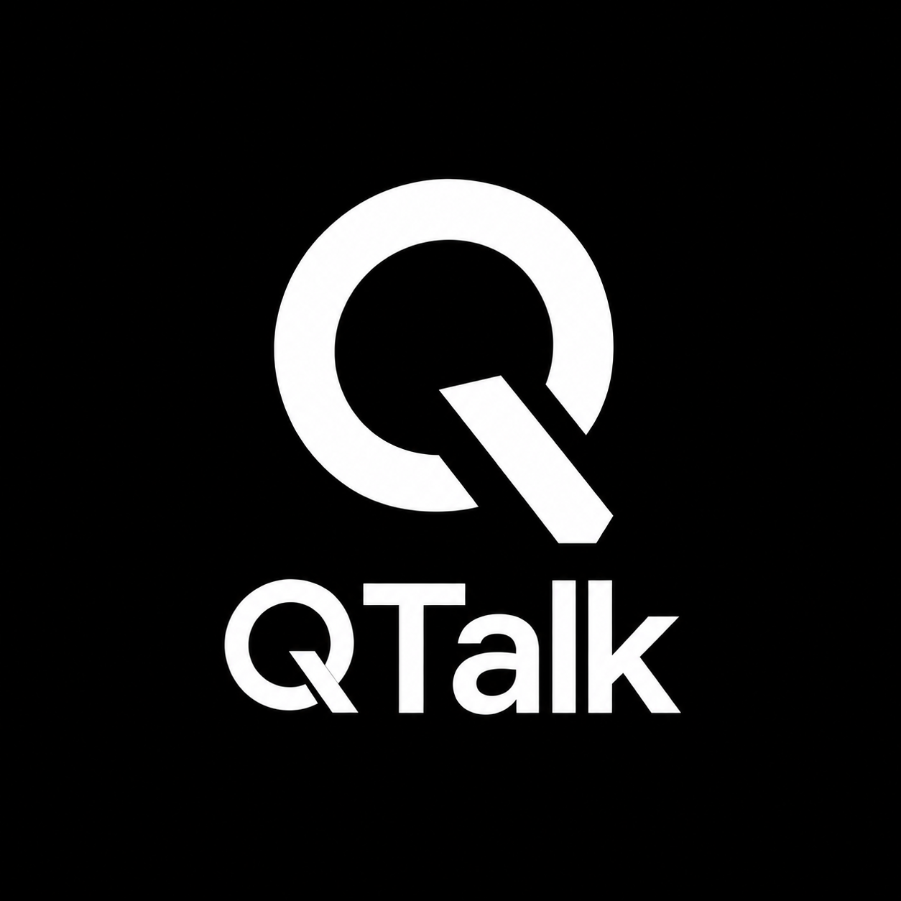

# QTalk

[English](README.md) | [Русский](README_RU.md)

<p align="center">
  
</p>

QTalk is an open-source, cross-platform SIP client focused on a fast and modern interface, flexible configuration, and a consistent user experience across desktop and mobile platforms.

The goal of the project is to create a modern and customizable softphone while keeping the application open-source and platform-independent.

## Status

> **Early development**

QTalk is currently under active development and is not yet intended for everyday or production use.

The basic application architecture and VoIP abstraction layer are already implemented. SIP functionality and Linphone SDK integration are currently in development.

## Platforms

| Platform | Status |
| --- | --- |
| Linux | 🚧 In development |
| Android | 🚧 In development |
| Windows | 🚧 In development |
| iOS | 🚧 In development |

Development is currently focused on the Desktop version and the shared Kotlin Multiplatform codebase.

## Build & Run

### Requirements

- JDK 21
- Git
- Gradle
- Any compatible IDE (I use IntelliJ IDEA)

## Tech Stack

- **Kotlin**
- **Kotlin Multiplatform**
- **Compose Multiplatform**
- **Kotlin Coroutines / Flow**
- **Linphone SDK / liblinphone** — SIP and VoIP engine
- **Gradle**
- **Nix** — Linux development environment

## Architecture

QTalk separates application logic from the underlying VoIP implementation.

```text
              QTalk
                │
       ┌────────▼────────┐
       │       UI        │
       │    Compose MP   │
       └────────┬────────┘
                │
       ┌────────▼────────┐
       │    ViewModel    │
       └────────┬────────┘
                │
       ┌────────▼────────┐
       │     Domain      │
       │    Use Cases    │
       └────────┬────────┘
                │
       ┌────────▼────────┐
       │   VoipEngine    │
       │   abstraction   │
       └────────┬────────┘
                │
       ┌────────▼────────┐
       │Linphone adapter │
       └────────┬────────┘
                │
       ┌────────▼────────┐
       │  Linphone SDK   │
       └─────────────────┘
```

The shared code is divided into several main layers:

```text
shared/
└── src/commonMain/
    └── kotlin/com/qvoste/qtalk/
        ├── app/        # Application initialization and dependency wiring
        ├── data/       # Data sources and persistence
        ├── domain/     # Application logic and use cases
        ├── ui/         # Compose UI and ViewModels
        └── voip/       # Platform-independent VoIP abstraction
```

The `VoipEngine` interface separates the application from a specific SIP implementation. This allows the shared QTalk logic to interact with VoIP functionality without directly depending on the Linphone API.

Platform-specific Linphone integration will be implemented behind this abstraction.

## License

QTalk is an open-source project.

The project is intended to use the **GNU AGPLv3** license, taking into account the licensing requirements of the open-source version of the Linphone SDK.

The final project license and information about third-party components will be added after the specific Linphone SDK version is integrated.